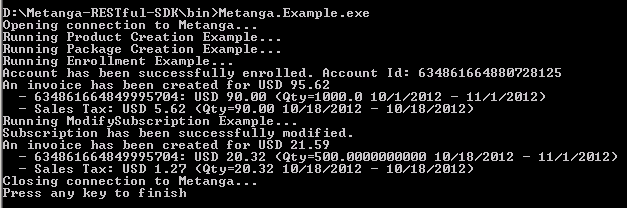

Metanga-RESTful-SDK
===================

The RESTful SDK for Metanga can be used by any .NET application to quickly integrate with Metanga.

The SDK comes with examples that will execute the following steps:

1. Connect to Metanga
2. Create a Reservation Product
3. Create a Package with a Recurring Reservation
4. Enroll a new Account into a Package and produce an Invoice
5. Increase the subscribed quantity and produce an Invoice

To use this SDK you will need Visual Studio 2010 (Professional Edition or better)

To quickly try the examples, do the following
* Open and Build the Solution
* In the build directory (normally the .\bin folder under the project), open Metanga.Example.exe.config with a  
text editor (or in Visual Studio) and set the address and credentials for your Metanga instance.
* Execute Metanga.Example.exe

This shows the output from the Metanga Example program:

After running your initial example, you can make adjustments to create packages, products, and
subscriptions that meet your business needs and integrate with your applications.

About the Example
-----------------

The sample program creates a Cloud Storage product that has a list price of $0.10 / Gigabyte / Month.
In Metanga the package can be used to override the list price defined in the product. In this example, the
package has a price of $0.09 / Gigabyte / Month.

The account being created has been configured to be billed on the last day of the month, and is being enrolled
to start on the 1st day of the current month. The enrollment is for 1000 Gigabytes, which are invoiced in advance
at the time of enrollment.

Therefore, the initial invoice is for 1000 Gigabytes x 1 Month x $0.09 / Gb/Mo = $90.

If you have taxes configured in your Metanga instance you will also see appropriate taxes being applied.

After the account is enrolled, the last API call assumes that the account has decided to purchase an additional
500 Gb. of storage starting today. In the attached screenshot you see an example that was executed on October 18, 2012.
Therefore, only 14 days of October should be billed. The equivalent is 0.4516 months.

The new invoice is for 500 Gigabytes x 0.4516 months x $0.09 / Gb/Mo = $20.32 (before taxes)